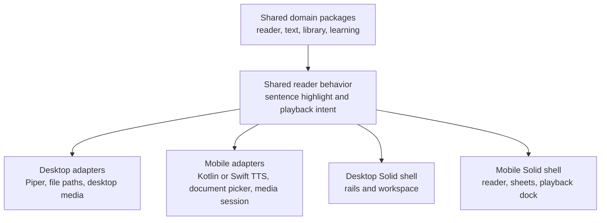

# Mobile Platform Plan

## Status

Proposed for review.

## Purpose

Extend Sonelle to mobile without duplicating its reader, book, and playback behavior. The mobile app must remain local-first, reader-first, and responsive on real devices. Performance is a release requirement, not a pleasant surprise that may or may not arrive after launch.

## Recommendation

Build an Android-first mobile proof using Tauri 2, the existing Solid renderer, and native mobile adapters for platform-sensitive work.

Keep the following shared:

- TypeScript domain packages for reader, text, library, audio contracts, and learning.
- Rust EPUB extraction, storage model, and command-facing use cases where they can run on mobile.
- Reader behavior: sentence-level highlighting, chapter navigation, progress, bookmarks, search, and word selection.
- The event and projection model already used for import, playback position, and narration state.

Implement the following with mobile-native code:

- Android text-to-speech, audio focus, media controls, and background playback in Kotlin.
- iOS equivalents in Swift when iOS begins.
- Document picking and copying a selected EPUB into the app sandbox.
- Native lifecycle, interruption, Bluetooth, headset, and lock-screen integration.

Tauri remains the mobile shell only while it passes the real-device performance gates in this plan. A native Kotlin reader is the fallback for Android only if that evidence says the shared WebView reader cannot meet the product bar. Flutter, Expo, and React Native are not fallback choices merely because they sound more mobile; they would require a UI rewrite without guaranteeing that the product-specific bottlenecks disappear.

## Why This Fits Sonelle

The repository is already prepared for Tauri mobile targets:

- `apps/desktop/src-tauri/Cargo.toml` builds a shared library as well as the desktop binary.
- `apps/desktop/src-tauri/src/lib.rs` has the mobile entry point.
- The renderer already limits the visible sentence range for large chapters.
- The product modules were intentionally split so storage, import, audio, and reader behavior can have platform adapters.

The desktop implementation is not automatically mobile-ready. In particular:

- The Piper/Python subprocess narration adapter is desktop-only.
- EPUB import currently expects a desktop-style path and supports drag and drop.
- Desktop asset URLs assume app-data paths and the desktop asset protocol.
- The three-column reader shell is a desktop workspace, not a phone layout.

## Product Shape on Mobile

The reader remains the primary surface. A phone should not attempt to squeeze the desktop rails into a narrow screen.

| Desktop surface      | Mobile equivalent                                       |
| -------------------- | ------------------------------------------------------- |
| Library rail         | Library and table-of-contents sheet                     |
| Reader surface       | Full-screen reader                                      |
| Inspector rail       | Contextual sheet for word, search, bookmarks, and tools |
| Bottom playback rail | Compact playback dock with an expandable control sheet  |

Mobile interaction requirements:

- Tapping a word opens a definition without disturbing the reading position or narration.
- Chapter navigation remains available from the reader header or a sheet.
- Playback keeps sentence-level highlighting only. Word-level timing remains out of scope.
- Reader controls have touch-sized targets and do not cover the active passage.
- The app restores the reader and playback state appropriately after an interruption or return from the background.

## Architecture Boundary

The reader UI must depend on a small narration and book-library interface. It must not know whether a platform produced an audio file, is speaking through a system voice, or received a document-provider URI.

### Proposed Platform Interfaces

| Interface             | Owns                                                                | Desktop adapter                       | Mobile adapter                                                                            |
| --------------------- | ------------------------------------------------------------------- | ------------------------------------- | ----------------------------------------------------------------------------------------- |
| `BookImportGateway`   | Selecting, copying, and opening an EPUB source                      | Dialog plus path import and drag/drop | Native document picker plus sandbox copy; share and file-association entry points later   |
| `LibraryStore`        | Local book, chapter, bookmark, position, and search persistence     | Current SQLite store                  | Mobile-safe SQLite and app-data location, verified on device                              |
| `NarrationGateway`    | Preparing, starting, stopping, and reporting sentence narration     | Piper-backed prepared audio           | Native TTS with sentence completion, interruption, and voice-quality state                |
| `MediaSessionGateway` | Background playback, audio focus, lock screen, and headset controls | Desktop audio behavior                | Android media session and foreground playback; iOS audio session and now-playing controls |
| `MediaSourceGateway`  | Safe URLs for cover and prepared-audio media                        | Desktop asset protocol                | Mobile-safe local media source or native playback handle                                  |

The narration interface must report one stable lifecycle to the reader:

- narration is ready or needs attention
- the sentence starts
- the sentence completes or fails
- playback stops or is interrupted

The reader uses those events to update sentence highlighting and advance playback. It does not branch on Android, iOS, Piper, WAV files, or native voice APIs.

## Delivery Phases

### Phase 0: Define the Benchmark Contract

Goal: decide what "fast enough" means before framework preference turns into religion.

Work:

- Choose two Android baseline devices: one midrange and one lower-cost device representative of the intended audience.
- Select a representative EPUB corpus: a small book, a large book with long chapters, and a book with a cover and complex navigation metadata.
- Record release-build metrics, never dev-server impressions.
- Add a device QA worksheet for startup, import, reading, narration, interruption, background playback, and resume.

Exit criteria:

- Baseline devices and test books are named.
- Metric capture is repeatable.
- The team agrees that measured results, not framework reputation, decide whether Tauri proceeds.

### Phase 1: Mobile Boot and Capability Setup

Goal: run the existing app on an Android device with no feature redesign yet.

Work:

- Initialize the Android Tauri target and mobile capability configuration.
- Confirm the Rust shared library and mobile entry point build correctly.
- Add a mobile capability file rather than granting desktop permissions indiscriminately.
- Run the fixture reader on a physical device and establish release-build profiling tools.
- Document Android SDK, emulator, and real-device development commands.

Exit criteria:

- The fixture reader launches on a physical Android device.
- The app can be profiled in a release-like build.
- No desktop-only capability is assumed to work on mobile.

### Phase 2: Platform Seams Before Product Work

Goal: make desktop behavior explicit adapters rather than accidental assumptions in shared code.

Work:

- Move path selection, media URL creation, narration implementation, and platform-specific lifecycle behavior behind the proposed interfaces.
- Keep the existing desktop adapters working and covered by their current tests.
- Replace broad runtime checks with adapter composition at the application boundary.
- Add fake mobile adapters for interface-level tests before native code exists.

Exit criteria:

- Reader and library UI can execute against desktop, fake, or mobile adapters without platform checks scattered through components.
- Import, playback position, and narration projections remain driven by domain events.
- Desktop regression checks still pass.

### Phase 3: Android Local Library Vertical Slice

Goal: prove a real EPUB can become a durable, readable mobile book.

Work:

- Implement Android document selection and copy the selected EPUB into Sonelle-controlled storage.
- Adapt the Rust importer and SQLite store to the mobile app-data directory; resolve any mobile build or filesystem limitations here.
- Replace desktop-only cover and audio source assumptions with the media-source interface.
- Implement mobile import states and resume reading from saved position.
- Add a mobile entry point for receiving a shared EPUB later, but do not make it a release blocker.

Exit criteria:

- A user imports each representative EPUB on-device.
- Imported books survive app restart.
- Chapter navigation, search, bookmarks, and reading position work against the real mobile store.
- Import never freezes the reader surface.

### Phase 4: Native Narration and Background Playback

Goal: make listening dependable in the ways users notice immediately.

Work:

- Implement the Android narration adapter with native TTS and sentence completion callbacks.
- Configure audio focus, media session controls, headset and Bluetooth actions, and foreground playback as required by Android.
- Preserve the quality gate: an unsuitable system voice reports that narration needs attention rather than quietly becoming Sonelle's normal listening experience.
- Handle interruption, pause, stop, headset disconnect, app backgrounding, and return-to-app states.
- Keep the reader's sentence highlight and next-sentence prefetch intent independent from the native voice implementation.

Exit criteria:

- Playback advances sentence by sentence without stale highlights or double advancement.
- The app can continue, pause, and resume narration correctly from the lock screen and background.
- A user can recover from an interrupted voice session without reopening the book.

### Phase 5: Mobile Reader Shell

Goal: present the shared reader behavior in a touch-first layout.

Work:

- Introduce `DesktopReaderShell` and `MobileReaderShell` compositions around shared reader content.
- Implement the library/table-of-contents sheet, tools sheet, compact header, and playback dock.
- Preserve a stable reading column and avoid layout shifts when sheets, word insight, or playback state changes.
- Add touch and accessibility behavior: focus order, screen-reader labels, dynamic text sizing, safe-area padding, and minimum target sizes.

Exit criteria:

- A reader can complete the core mobile flow without encountering a desktop rail.
- Active narration, word insight, and playback controls never cover the current sentence incoherently.
- Desktop layout remains unchanged apart from shared component extraction where needed.

### Phase 6: Reliability and Release Readiness

Goal: turn a successful demo into a trustworthy local reader.

Work:

- Test cold launch, warm launch, background/foreground transitions, low-storage behavior, and process recovery.
- Test long reading and listening sessions with the representative EPUB corpus.
- Add Android crash reporting and privacy-preserving local diagnostics only after the core flow is stable.
- Prepare Play Store packaging, privacy disclosure, icon assets, signing, and release workflow.
- Repeat the same plan for iOS only after Android passes its performance gate and macOS/Xcode build infrastructure is available.

Exit criteria:

- Android passes the performance and reliability gates below.
- A release checklist has manual device evidence, not just emulator screenshots.
- The team has an explicit go/no-go decision for iOS and for continuing with Tauri.

## Performance and Reliability Gates

These targets apply to release builds on both baseline Android devices. Exact tooling can vary, but every result must include device model, OS version, book, and build version.

| Area                 | Gate                                                                                                                                        |
| -------------------- | ------------------------------------------------------------------------------------------------------------------------------------------- |
| Reader scroll        | 95th percentile frame time at or below 16.7ms during a scripted reading scroll; no sustained jank while the active sentence changes         |
| Input response       | Tap feedback and reader controls visibly respond within 100ms under the reading stress case                                                 |
| Book open            | Persisted-book open and chapter switch complete within 400ms at the 95th percentile for the large-book corpus                               |
| Import               | Import runs off the UI path; the app remains responsive, and the completed book opens without an avoidable second parse                     |
| Narration handoff    | Ready narration changes sentences with no audible or visual gap above 250ms at the 95th percentile                                          |
| Background narration | Lock-screen, headset, Bluetooth, interruption, pause, resume, and app return pass manually on both devices                                  |
| Memory               | A 60-minute reading/listening run reaches a stable memory range and does not trigger a process kill, progressive slowdown, or lost position |
| Reliability          | No data loss for imported books, bookmarks, or reading position across normal restart and recoverable interruption cases                    |

## Tauri Continuation Gate

Continue with the Tauri mobile shell only when all of the following are true:

- The Android proof slice meets the performance and reliability gates.
- The WebView reader remains smooth with the real large-book corpus.
- Native adapters provide reliable narration and background playback.
- Mobile import and local storage work without broad filesystem permissions or fragile path assumptions.

If any gate fails, first isolate the cause. A slow importer or a poor TTS lifecycle is an adapter problem, not automatic proof that the renderer must be replaced.

Choose a native Android reader only when the measured blocker is specifically the shared WebView reader or its interaction model, and the issue cannot be fixed through rendering limits, component structure, or native adapter boundaries. That fallback means Kotlin UI on Android and a later SwiftUI implementation on iOS, with a deliberate plan for sharing Rust core logic. It is a costly fork, not a casual optimization.

## Testing Strategy

| Layer                   | Coverage                                                                                                         |
| ----------------------- | ---------------------------------------------------------------------------------------------------------------- |
| Shared packages         | Existing unit tests plus adapter-contract tests for import, narration lifecycle, and media source behavior       |
| Rust core               | EPUB extraction, storage migrations, search, bookmarks, reading position, and mobile-safe path tests             |
| Native Android adapters | Instrumented tests for document import, narration events, audio focus, and lifecycle transitions                 |
| Mobile renderer         | Component tests for reader/sheet state transitions and accessibility labels                                      |
| Device QA               | Release-build manual runs against representative books, backgrounding, lock screen, Bluetooth, and interruptions |
| Performance             | Repeatable scripted runs with recorded frame, latency, memory, and import/open timings                           |

## Explicitly Out of Scope for the First Mobile Release

- Cloud sync or automatic desktop-to-phone library transfer.
- iOS implementation before Android proves the architecture.
- Word-level audio highlighting.
- Full parity for every desktop power tool before the mobile core flow is trustworthy.
- A platform rewrite based on aesthetics or framework fashion rather than benchmark evidence.
- Marketplace, social, DRM, or remote-TTS dependencies.

## Deliverables

- Android build and device setup documentation.
- Mobile capability configuration and a platform adapter module map.
- Android EPUB import, local storage, native narration, media session, and lifecycle adapters.
- Shared reader interfaces with desktop, mobile, and fake implementations.
- Mobile Solid reader shell and touch-first sheets.
- Device QA worksheet, representative EPUB corpus, and captured performance results.
- A decision record confirming either Tauri mobile continuation or a native-UI fallback after the proof slice.

## Review Questions

Resolve these before Phase 1 begins:

1. Is Android the correct first release target, or is iOS commercially required at the same time?
2. Which two real Android devices define the minimum acceptable experience?
3. Is a separate local library on each device acceptable for the first mobile release?
4. Which offline voices meet Sonelle's narration-quality bar on Android?
5. Must shared EPUB links and file associations ship in the first release, or can document picking launch first?
6. Do the proposed performance gates match the experience we want users to feel?
